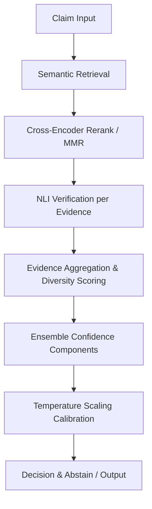

## Technical Documentation: Smart Notes Pipeline

This document summarizes the 7-stage verification pipeline, configuration, and algorithm pseudocode used by the Smart Notes evaluation.

### 7-stage Pipeline (high level)



### Pseudocode (algorithm box)

```
function VERIFY_CLAIM(claim, cfg):
    candidates = RETRIEVE(claim, top_k=cfg.top_k_retrieval)
    reranked = RERANK(candidates, top_n=cfg.top_k_rerank, mmr_lambda=cfg.mmr_lambda)
    nli_results = [NLI(claim, doc) for doc in reranked]
    # component scores: semantic, entailment, diversity, agreement, margin, authority
    components = COMPUTE_COMPONENT_SCORES(reranked, nli_results)
    raw_score = WEIGHTED_SUM(components, weights)
    if cfg.temperature_scaling_enabled:
        calibrated = APPLY_TEMPERATURE(raw_score, tau)
    else:
        calibrated = raw_score
    if calibrated > cfg.verified_confidence_threshold and COUNT_ENTAILING_SOURCES(nli_results) >= cfg.min_entailing_sources_for_verified:
        return SUPPORTED, calibrated
    if calibrated < cfg.rejected_confidence_threshold:
        return REFUTED, calibrated
    return NEI, calibrated
```

### Configuration

- All thresholds and hyperparameters are centralized in `src/config/verification_config.py` and exposed through environment variables. This includes calibration split, temperature grid, retrieval `top_k` and rerank sizes, and decision thresholds.

### Reproducibility notes

- Deterministic seeds are set for `random` and `numpy` via the configuration `random_seed` parameter. For PyTorch-based runs, see `docs/REPRODUCIBILITY.md` for recommended deterministic flags.
# Technical Documentation

Overview of pipeline stages, configuration, and metrics definitions.

See `config.py` and `src/config/verification_config.py` for centralized verification thresholds.

Pipeline stages:
- Ingest → segment → embed → retrieve → rerank → NLI → aggregate → calibrate → export

Metrics:
- Accuracy, Macro-F1, Per-class precision/recall/F1, Confusion matrix
- ECE (Expected Calibration Error), Brier score
- Risk-Coverage curves and AUC-RC

## Evaluation runner & reproducibility

A lightweight evaluation harness is provided in `src/evaluation/runner.py`. It
supports four modes:

1. `baseline_retriever` – uses retrieval similarity only.
2. `baseline_nli` – NLI entailment probability only.
3. `baseline_rag_nli` – simple weighted blend of retrieval+NLI.
4. `verifiable_full` – the full pipeline: semantic retrieval,
   NLI verification, thresholding and optional temperature calibration.

The runner is deterministic: it seeds `random`/`numpy` using
`VerificationConfig.random_seed` and records the seed in
`metadata.json`. It writes both JSON and Markdown summaries plus plot files
(`reliability.png`, `confusion.png`) under `outputs/benchmark_results/latest`.

**Real‑model path vs. simulation**: when the required ML libraries are
available (`sentence-transformers`, `faiss-cpu`, `transformers`), the
runner dynamically instantiates `SemanticRetriever` and `NLIVerifier`, indexes
a trivial synthetic corpus, and performs retrieval+NLI for each claim. If any
model import fails (e.g. in stripped-down CI or during early development), the
runner logs a warning and falls back to a fast synthetic prediction generator.
This behaviour is exercised by `tests/test_evaluation_runner_real.py` which
stubs out the heavy classes to keep the test suite fast.

## Dependencies and installation

The full pipeline requires the following additional packages (installed in the
project virtual environment):

```sh
pip install sentence-transformers faiss-cpu transformers
```

These are already listed in `requirements-lock.txt` and pulled in by the
reproducibility scripts. The `runner` gracefully handles their absence for
lightweight testing.

---

